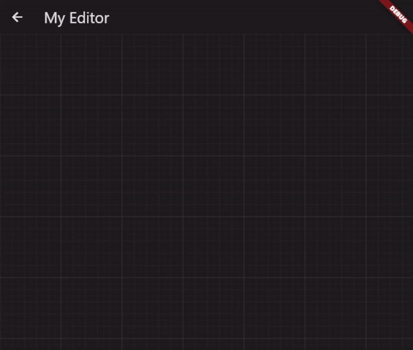

<div align="center">
  <a href="#">
    
  </a>
  <h1>Flutter Context Menu</h1>
  <p>
    A Flutter library that provides a flexible and customizable solution for creating and displaying context menus in your <b>mobile</b>, <b>web</b>, and <b>desktop</b> applications.
    <br/><br/>
  </p>
  <!-- <h3>
    <a href="https://salah-rashad.github.io/flutter_context_menu_docs" target="_blank" style="color: white">
      Explore the docs »
    </a>
  </h3> -->
  <a href="https://github.com/salah-rashad/flutter_context_menu/tree/main/example" target="_blank">
    View Example
  </a>
   · 
  <a href="https://github.com/salah-rashad/flutter_context_menu/issues/new?labels=bug&assignees=salah-rashad" target="_blank">
    Report Bug
  </a>
   · 
  <a href="https://github.com/salah-rashad/flutter_context_menu/issues/new?labels=feature&assignees=salah-rashad" target="_blank">
    Request Feature
  </a>
  <br/><br/>
  <a href="https://pub.dev/packages/flutter_context_menu" target="_blank">
     
  </a>
  <a href="https://github.com/salah-rashad/flutter_context_menu/blob/master/LICENSE" target="_blank">
     
  </a>
  <br/><br/>
</div>



## Features

- **`ContextMenu` Widget**: The package includes a highly customizable context menu widget that can be easily integrated into your Flutter application. It provides a seamless and intuitive user experience, enhancing the usability of your app.

- **Hierarchical Structure**: The context menu supports a hierarchical structure with submenu functionality. This enables you to create nested menus, providing a clear and organized representation of options and suboptions.

- **Customization Options**: Customize the appearance and behavior of the context menu to match your app's design and requirements. Modify the style, positioning, animation, and interaction of the menu to create a cohesive user interface.

- **Selection Handling**: The package includes built-in selection handling for context menu items. It allows you to define callback functions for individual menu items, enabling you to execute specific actions or logic when an item is selected.

## Getting Started

To get started, install the package using the following command:
```bash
flutter pub add flutter_context_menu
```

or add the following dependency to your `pubspec.yaml` file:

```yaml
dependencies:
    flutter_context_menu: ^0.1.2
```

## Usage

1. To use the package in your project, simply add the following import statement to your app's `main.dart` file:
    ```dart
    import 'package:flutter_context_menu/flutter_context_menu.dart';
    ```
2. Create a list of menu entries and pass it to the `ContextMenu` widget:
    ```dart
    // Initialize a list of menu entries
    final entries = <ContextMenuEntry>[
      const MenuHeader(text: "Menu Header"),
      MenuItem(
        label: 'Copy',
        icon: Icons.copy,
      ),
      const MenuDivider(),
      MenuItem.submenu(
        label: 'Edit',
        icon: Icons.edit,
        items: [
          MenuItem(
            label: 'Undo',
            value: "Undo",
            icon: Icons.undo,
            onSelected: () {
              // implement undo
            },
          ),
          MenuItem(
            label: 'Redo',
            value: 'Redo',
            icon: Icons.redo,
            onSelected: () {
              // implement redo
            },
          ),
        ],
      ),
    ];
    ```
    ```dart
    // Initialize a context menu
    final myContextMenu = ContextMenu(
      entries: entries,
      position: const Offset(300, 300),
      padding: const EdgeInsets.symmetric(horizontal: 8.0),
    );
    ```

- finally, show the context menu:
  ```dart
  showContextMenu(context, contextMenu: myContextMenu);
  // or 
  myContextMenu.show(context);
  ```
  ```dart
  // Retrieve the selected item's value
  final selectedValue = await myContextMenu.show(context);
  print(selectedValue);
  ```

## Feedback and Contributions

We welcome feedback, bug reports, and contributions from the Flutter community. Help us improve the package by providing suggestions, reporting issues, or submitting pull requests on [GitHub](https://github.com/salah-rashad/flutter_context_menu).
